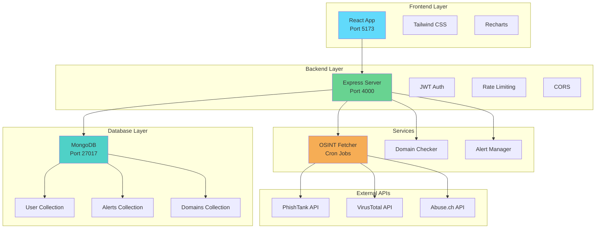

# Architecture Diagram

```mermaid
graph TB
    subgraph "Frontend Layer"
        A[React App<br/>Port 5173]
        B[Tailwind CSS]
        C[Recharts]
    end
    
    subgraph "Backend Layer"
        D[Express Server<br/>Port 4000]
        E[JWT Auth]
        F[Rate Limiting]
        G[CORS]
    end
    
    subgraph "Database Layer"
        H[MongoDB<br/>Port 27017]
        I[User Collection]
        J[Alerts Collection]
        K[Domains Collection]
    end
    
    subgraph "External APIs"
        L[PhishTank API]
        M[VirusTotal API]
        N[Abuse.ch API]
    end
    
    subgraph "Services"
        O[OSINT Fetcher<br/>Cron Jobs]
        P[Domain Checker]
        Q[Alert Manager]
    end
    
    A --> D
    D --> H
    D --> O
    O --> L
    O --> M
    O --> N
    H --> I
    H --> J
    H --> K
    D --> P
    D --> Q
    
    style A fill:#61dafb
    style D fill:#68d391
    style H fill:#4fd1c7
    style O fill:#f6ad55
```
